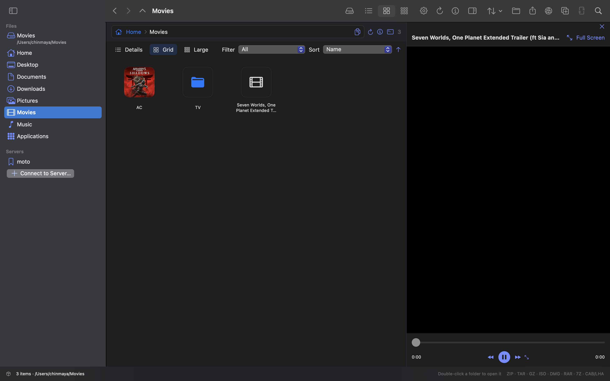
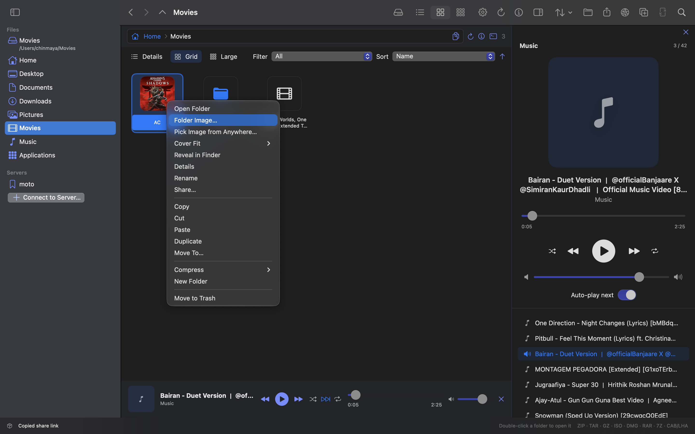
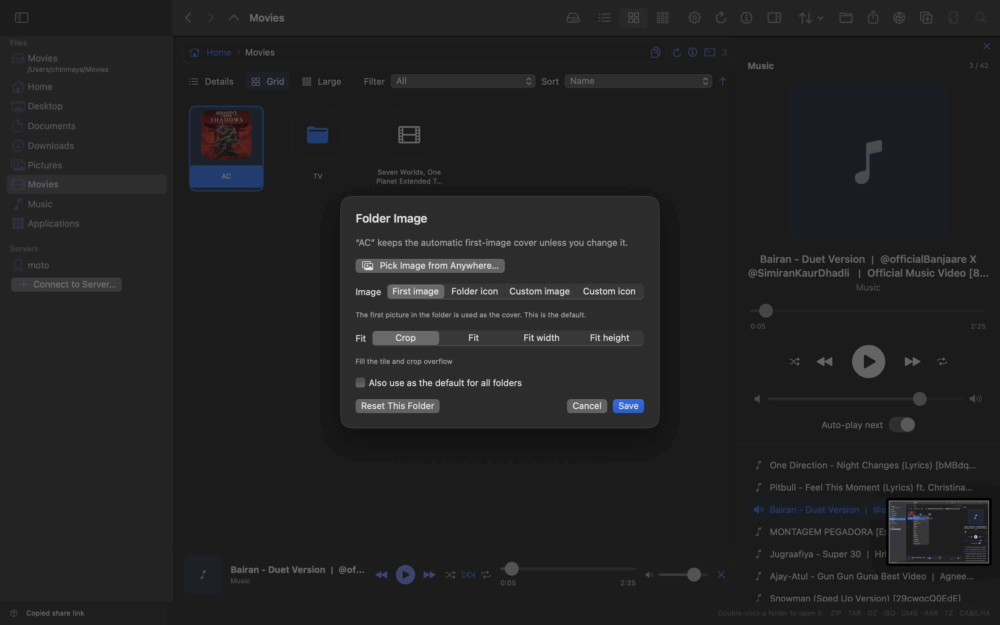
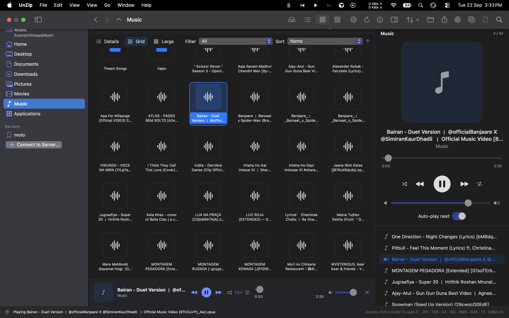
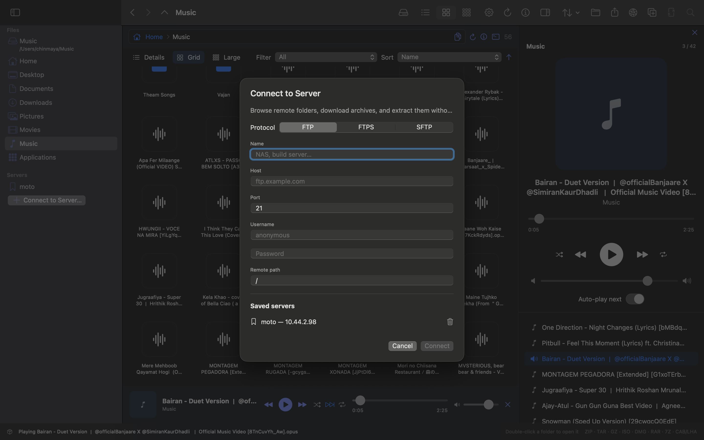
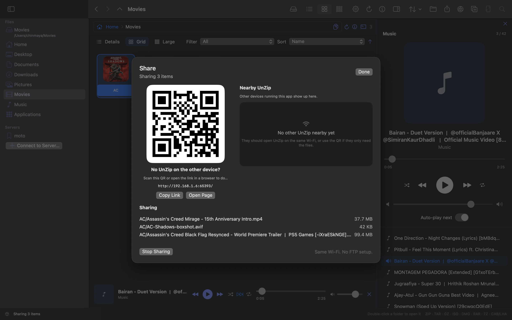
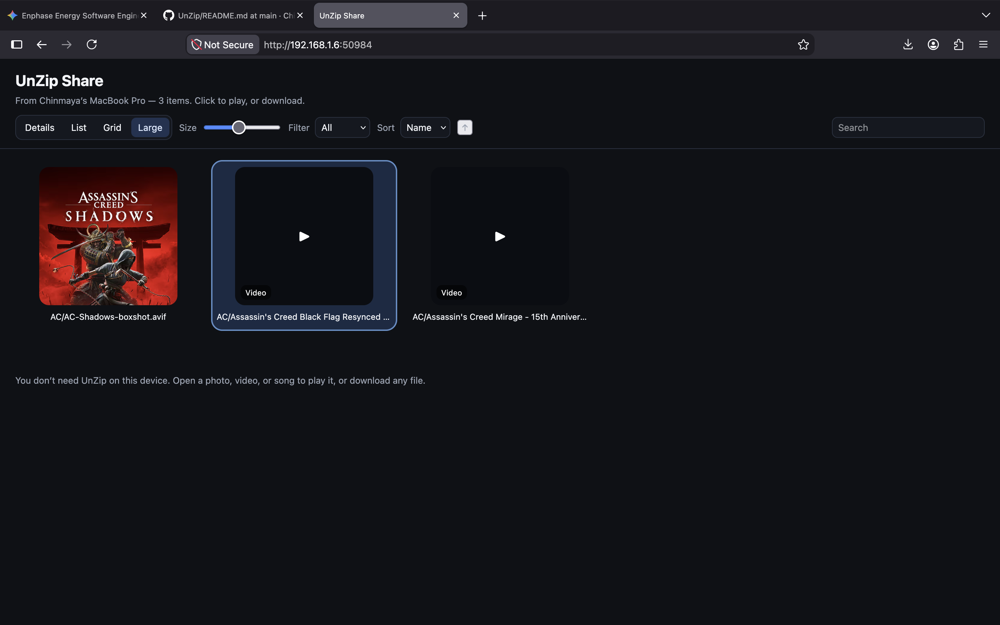
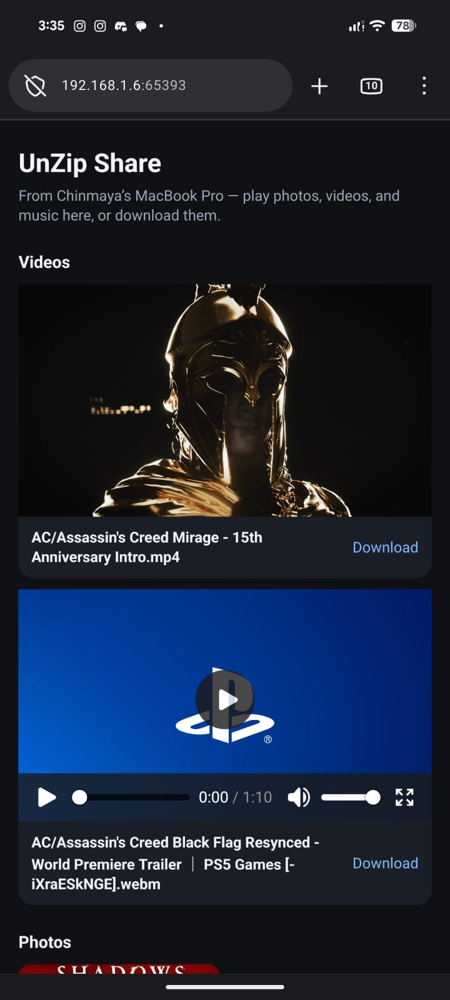
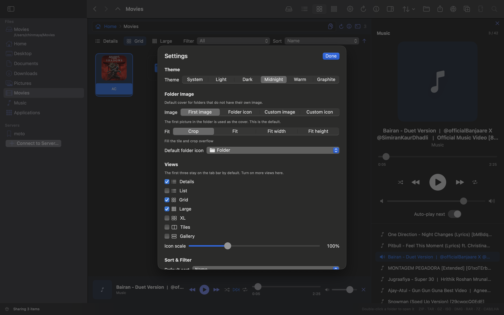

# How to use UnZip

UnZip is a file explorer first. It also opens archives, plays music and video, talks to FTP servers, and shares files over your local network.

**Free for anyone** — no account, no license key, no paid permission. The app is [public domain](LICENSE).

Install: download a `.dmg`, `.pkg`, or `.zip` from **[Releases](https://github.com/ChinmayaGit/UnZip/releases/latest)**. Build notes live in [README.md](README.md).

If macOS blocks the first launch, Control-click UnZip → **Open**. That is Gatekeeper, not a license.

---

## File explorer

**What it is for:** Browse your Mac like Finder, without leaving the app.

1. Open UnZip. It starts in your last folder, or Home.
2. Use the **sidebar**: Home, Desktop, Documents, Downloads, Pictures, Movies, Music, Applications.
3. Double-click a folder to enter it. Double-click a file to preview, play, or open it.
4. Switch views on the tab bar: **Details**, **Grid**, **Large** (and more if you turn them on in Settings).
5. Use **Filter** and **Sort** on the same bar. Search the current folder from the search field.

Toolbar back / forward / up work like a browser.

---

## Path bar (copy path + Terminal)

**What it is for:** See where you are, jump folders, copy the path, or open a shell in that folder.

The bar under the toolbar shows **Home › Movies** (or whichever folder you are in).

| Control | What it does |
| --- | --- |
| Folder crumbs | Click a name to go there |
| Path box | Select or edit the full path; press Return to go there |
| Copy icon | Copies the current path to the clipboard |
| Info (Details) | File or folder details |
| Terminal icon | Opens Terminal already `cd`’d to this folder |

Double-click the path area to type a path (including `~`).

---

## Selection and file actions

**What it is for:** Work with files the way you do in Finder.

- **Click**, **double-click**, or **right-click** an item to select it. It highlights blue.
- In Grid / Large / Gallery, drag on empty space to rubber-band select many items.
- **Shift-click** a range. **Command-click** to add or remove.
- Built-in folders such as Desktop and Documents cannot be moved to Trash.

| Action | How |
| --- | --- |
| Copy | Command-C or right-click **Copy** |
| Cut | Command-X |
| Paste | Command-V |
| Duplicate | Command-D |
| Rename | Command-Return or right-click **Rename** |
| Move To… | Right-click or Edit menu |
| Details | Command-I or the info button |
| Trash | Delete or right-click **Move to Trash** |
| Drag move | Drop onto the list or onto a folder |
| Drag copy | Hold **Option** while dropping |
| Open With | Right-click → **Open With** to pick VLC, QuickTime, Preview, and every other app registered for that file |
| Set as Default | Right-click → **Open With → Set as Default**, or the same menu in **Details** |

---

## Folder covers

**What it is for:** Folders with pictures show the first image as the icon instead of a generic folder.

1. Put any image in a folder. UnZip uses the first image by name as the cover.
2. Right-click the folder → **Folder Image…**
3. Choose **First image**, **Folder icon**, **Custom image**, or **Custom icon** (including `.ico`).
4. Set **Fit**: crop, fit, fit width, or fit height.
5. Optionally apply that style as the default for all folders.

**Pick Image from Anywhere…** if the picture is not already inside the folder.

---

## Preview pane

**What it is for:** See a file without opening another app.

Toggle it with **Option-Command-P** or the preview button in the toolbar.

- Images scale to fit; click **Full Screen** for the viewer
- Text and code are readable
- PDFs render in place
- Audio and video use the built-in players

---

## Images

**What it is for:** Flip through a folder of pictures.

1. Open a folder of images.
2. Double-click one, or use **View Image** / **Full Screen** in preview.
3. **Left** and **Right** go to the previous / next image in that folder.
4. **Esc** closes. There is also a fullscreen button.

---

## Music

**What it is for:** Play a folder of tracks without switching to Music.app.

1. Open a folder of audio. The **music bar** appears under the folder list.
2. Double-click a track, or press play on the bar.
3. Click the bar to open the full player in the preview pane (queue, shuffle, auto-next, loop, volume).
4. Set bar height in **Settings → Playback**.

Formats include MP3, AAC, M4A, FLAC, WAV, AIFF, Opus, OGG, and others.

---

## Video

**What it is for:** Watch files in the preview pane.

1. Double-click a video, or right-click **Play Video**.
2. Use play / pause, seek, volume, and **Full Screen**.
3. Videos are not treated as music (no shuffle / album extras on the video pane).
4. Right-click **Open With** to play in **VLC**, **QuickTime Player**, or another app. Use **Set as Default** if you always want that app.

MP4, MOV, M4V, MKV, WebM, and similar containers are recognized.

Some downloads (VP9 + Opus, many YouTube files) cannot be decoded by macOS. Install [VLC](https://www.videolan.org/vlc/). UnZip then **prepares** an H.264 copy so the picture can play in the preview pane. Playing the same file again is faster. Or right-click **Open With → VLC**.

---

## Archives

**What it is for:** Look inside zip/rar/iso files and create new archives.

**Open**

- Drop an archive on the window
- **File → Open Archive…** (Command-O)
- Double-click an archive in the file explorer

**Extract**

- Select files inside the archive → **Extract…** (Command-E)
- Or drag them to Finder / the Desktop

**Create**

- **File → Create ZIP…** (Command-N)
- Drop a folder or file on UnZip and choose compress
- Finder: right-click → **Services → Zip with UnZip**

Supported to open: ZIP, RAR, 7Z, TAR (gz / bz2 / xz / zst), ISO, DMG, GZIP, BZIP2, XZ, XAR / PKG, CPIO, CAB, LHA.

Create ZIP or RAR with High / Medium / Low compression and optional split volumes.

RAR/7Z extract needs `unar` / `p7zip`. Creating RAR needs the `rar` CLI. See [README.md](README.md).

---

## FTP, FTPS, and SFTP

**What it is for:** Browse a NAS, build server, or other remote box from the same window.

1. Click **Connect to Server…** in the sidebar, or press **Command-K**.
2. Choose **FTP**, **FTPS** (FTP over TLS), or **SFTP** (SSH).
3. Fill in name, host, port, username, password, and remote path.
4. Saved servers appear in the list so you can reconnect.
5. Browse folders, download a file, and open or extract it locally.

This is not a full website host. It is for file servers. Sharing files to a phone uses **Share** (below), which is HTTP on your LAN.

---

## Share (QR, HTTP, nearby UnZip)

**What it is for:** Send files to another Mac running UnZip, or to a phone / browser on the same Wi‑Fi. No extra FTP setup.

1. Select files or a folder (or stay in the folder you want to share).
2. **File → Share…** or **Shift-Command-S**, or right-click **Share…**.
3. A QR code and an `http://` link appear (for example `http://192.168.1.6:65393/`).
4. On another UnZip on the same network, the device shows up under **Nearby UnZip**.
5. On a phone or computer, scan the QR or open the link. You can **play** photos, video, and music, or **Download**.

Same Wi‑Fi. No account. Stop sharing when you are done.

The page is a local HTTP server UnZip starts on your Mac. Use it on a trusted network.

---

## Settings

**What it is for:** Theme, default folder covers, which views appear, sort, and the music bar.

Open **Settings…** (gear) or press **Command-comma**.

| Section | What you can change |
| --- | --- |
| Theme | System, Light, Dark, Midnight, Warm, Graphite |
| Folder image | Default cover (first image / icon / custom) and fit |
| Default folder icon | SF Symbol when a folder has no picture |
| Views | Turn Details, List, Grid, Large, XL, Tiles, Gallery on or off |
| Icon scale | 60%–200% |
| Sort and filter | Default sort, folders first, hidden files, extensions, kind filter |
| Playback | Music bar height (64–140 pt) |

Shuffle, auto-next, and loop live on the music player, not only in Settings.

---

## Keyboard shortcuts

| Shortcut | Action |
| --- | --- |
| Command-O | Open archive |
| Command-N | Create ZIP |
| Command-K | Connect to FTP / FTPS / SFTP |
| Command-E | Extract selected |
| Shift-Command-S | Share |
| Command-C / X / V | Copy / Cut / Paste |
| Command-D | Duplicate |
| Command-A | Select all |
| Command-I | Details |
| Command-Return | Rename |
| Command-R | Refresh |
| Delete | Move to Trash |
| Command-1 / 2 / 3 | Grid / Details / Large |
| Option-Command-P | Show or hide preview |
| Command-comma | Settings |
| Command-[ / ] | Back / Forward |
| Command-Up | Enclosing folder |
| Option-Command-1 | File manager |
| Return | Open selected |
| Left / Right | Previous / next image in the viewer |
| Esc | Close image viewer |
