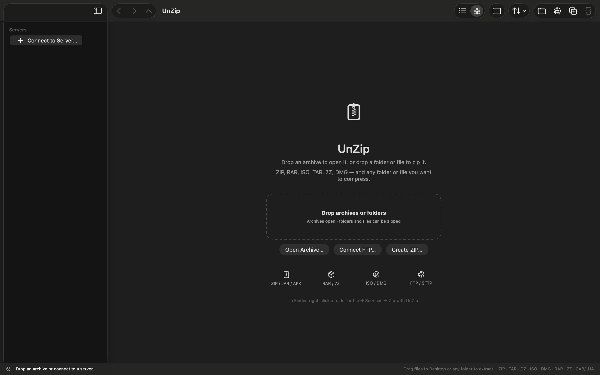
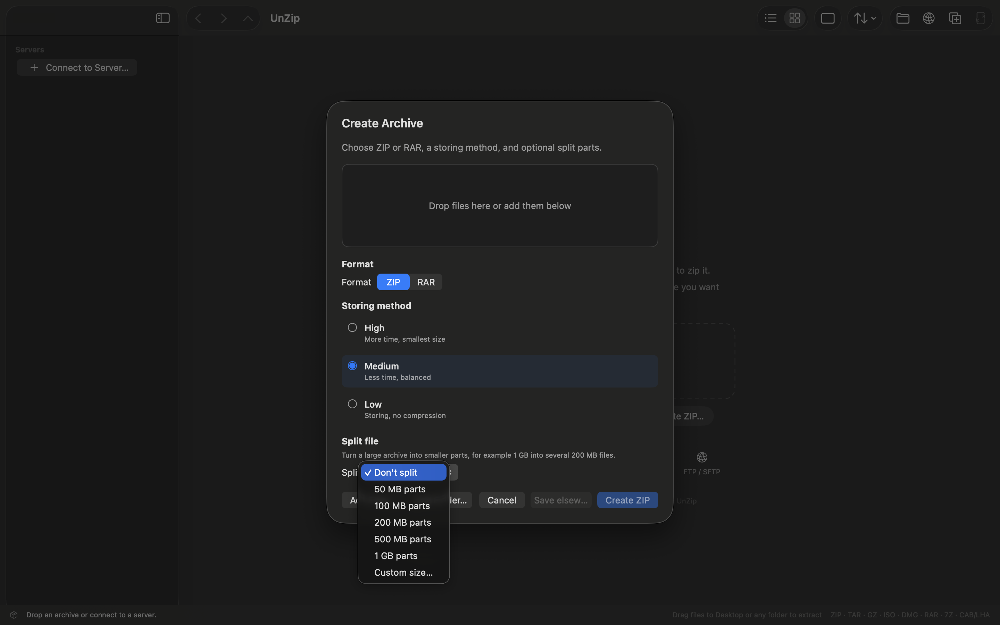
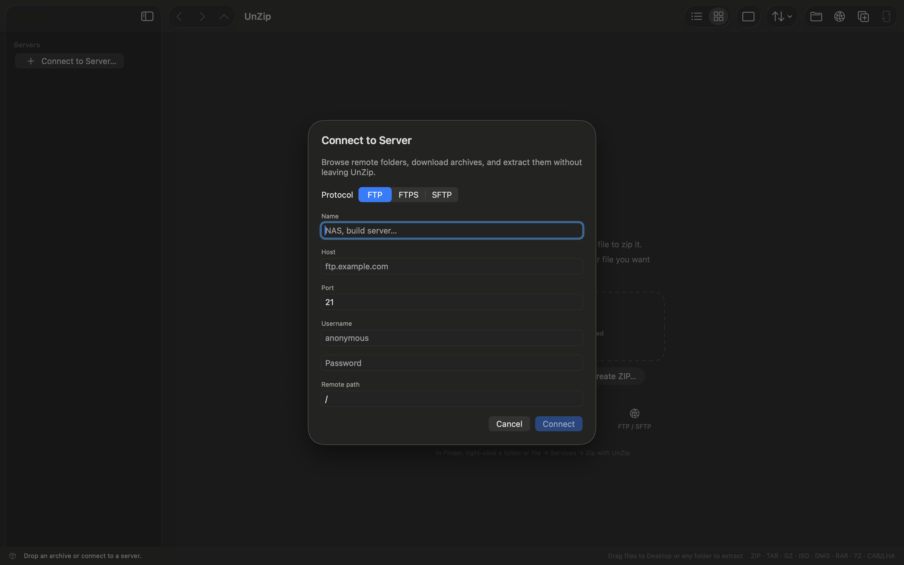
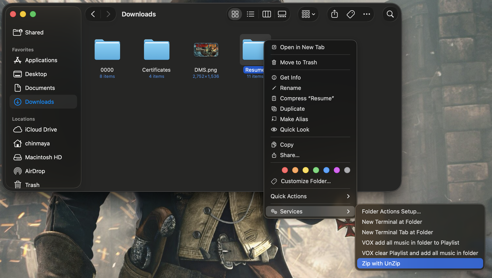

# UnZip

A native macOS app for browsing local files, opening archives, playing media, and compressing folders. It launches as a file manager.

Requires **macOS 14** or later. Works on **Apple Silicon** and **Intel**.

## Screenshots

Drop an archive to open it, or drop a folder or file to zip it.



Create a ZIP or RAR with High, Medium, or Low compression, and optional split volumes.



Connect to an FTP, FTPS, or SFTP server and browse remote files without leaving the app.



In Finder, right-click a folder or file → **Services → Zip with UnZip**.



## Features

### File manager

- Opens on your last folder, or Home
- Sidebar shortcuts: Home, Desktop, Documents, Downloads, Pictures, Movies, Music, Applications
- Path bar with clickable folders, an editable path box, **Copy path**, **Details**, and **Open Terminal here**
- Views: Details, List, Grid, Large, Extra Large, Tiles, Gallery
- Sort by name, date, type, or size
- Filter by folders, images, music, videos, archives, or documents
- Search the current folder
- Preview pane for images, text, PDF, audio, and video

### Folder covers

- A folder that contains pictures uses the first image (by name) as its cover
- Right-click a folder → **Folder Image…** to set fit/crop, a custom image, `.ico`, or a symbol
- Settings can set a default cover style for every folder

### Selection and file actions

- Click, double-click, or right-click an item to select it (blue highlight)
- Drag on empty space in Grid, Large, or Gallery to rubber-band select
- Shift-click for a range; Command-click to add or remove
- Copy, cut, paste, duplicate, move, rename, and Move to Trash
- Drag files onto a folder to move them; hold **Option** while dropping to copy
- Desktop, Documents, Downloads, and other built-in home folders cannot be trashed
- **Details** (Command-I) shows name, path, size, and dates

### Images

- Double-click an image, or use **View Image** / **Full Screen** in preview
- In the viewer, left and right arrows move through pictures in the same folder
- Esc closes; there is also a fullscreen button

### Music and video

- Double-click audio or video to play it in the app
- Music bar under the folder list: play/pause, next/previous, seek, volume, shuffle, auto-next, loop
- Click the music bar to open the full player in the preview pane
- Videos use play, pause, volume, and fullscreen (they are not treated as music)
- Common formats: MP3, AAC, FLAC, WAV, MP4, MOV, MKV, WebM, and others
- VP9 files (many YouTube downloads) need **VLC** installed. UnZip buffers a live stream so the picture starts without waiting for a full convert. The next play of the same file is faster.

### Archives

- Open ZIP, RAR, 7Z, TAR (gz/bz2/xz/zst), ISO, DMG, GZIP, BZIP2, XZ, XAR/PKG, CPIO, CAB, LHA
- Browse inside an archive, preview files, extract selected items
- Create ZIP or RAR with High / Medium / Low compression and optional split volumes
- Drag files onto UnZip to open an archive or offer to compress

### Network and sharing

- Connect to FTP, FTPS, or SFTP and browse remote folders
- Download a remote file and open it
- **Share…** (Shift-Command-S) publishes the current selection so another UnZip nearby can receive it

## How to use

### Browse files

1. Open UnZip. The file manager is the home screen.
2. Use the sidebar, path crumbs, or paste a path in the address box and press Return.
3. Switch views from the tab bar or the **View** menu.
4. Double-click a folder to enter it. Double-click a file to preview, play, or open it.

### Copy, move, delete

| Action | How |
| --- | --- |
| Copy | Command-C or right-click **Copy** |
| Cut | Command-X |
| Paste | Command-V |
| Duplicate | Command-D |
| Move To… | Right-click or Edit menu |
| Trash | Delete or right-click **Move to Trash** |
| Drag move | Drop onto the list or a folder |
| Drag copy | Hold **Option** while dropping |

### Pictures

1. Open a folder of images.
2. Double-click one, or select it and click **Full Screen** in preview.
3. Use the arrow keys to go through the folder.

### Music

1. Open a folder of tracks. The music bar appears at the bottom of the folder column.
2. Press play, or double-click a track.
3. Click the bar to open the full player (queue, shuffle, loop).
4. Set bar height in **Settings → Playback**.

### Video

1. Double-click a video, or right-click **Play Video**.
2. Use play/pause, volume, and fullscreen in the preview pane.
3. For VP9/WebM that macOS cannot decode, install [VLC](https://www.videolan.org/vlc/). UnZip buffers through VLC so the picture plays in the app.

### Archives

- **Open:** drop an archive on the window, **File → Open Archive…** (Command-O), or double-click a zip in the file manager.
- **Extract:** select files inside the archive and press **Extract…** (Command-E), or drag them to Finder.
- **Create:** **File → Create ZIP…** (Command-N), or drop a folder/file on UnZip and choose compress.
- **Finder:** right-click → **Services → Zip with UnZip**.

### Path bar

- Click a crumb to jump to that folder.
- Double-click the path area to edit the path; press Return to go there.
- The copy icon copies the current path.
- The info button opens Details for the selection (or the current folder).
- The terminal button opens Terminal in the current folder.

## Settings

Open **Settings…** from the toolbar or press Command-comma.

### Theme

System, Light, Dark, Midnight, Warm, Graphite.

### Folder image

- Default cover: first image, folder icon, custom image, or a symbol
- Fit: crop, fit, fit width, fit height
- Default folder SF Symbol when no cover image is used

Per-folder covers are set on the folder: right-click → **Folder Image…**

### Views

- Turn layouts on or off. The first enabled views stay on the tab bar.
- Icon scale from 60% to 200%

### Sort and filter

- Default sort (name, date, type, size)
- Folders first
- Show hidden files
- Show file extensions
- Kind filter (all, folders, images, music, videos, archives, documents)

### Playback

- Music bar height (64–140 pt)
- Shuffle, auto-next, and loop are on the player itself

## Keyboard shortcuts

| Shortcut | Action |
| --- | --- |
| Command-O | Open archive |
| Command-N | Create ZIP |
| Command-K | Connect to server |
| Command-E | Extract selected |
| Shift-Command-S | Share |
| Command-C / X / V | Copy / Cut / Paste |
| Command-D | Duplicate |
| Command-A | Select all |
| Command-I | Details |
| Command-Return | Rename |
| Command-R | Refresh |
| Delete | Move to Trash |
| Command-1 / 2 / 3 | Grid / Details / Large |
| Option-Command-P | Show or hide preview |
| Command-comma | Settings |
| Command-[ / ] | Back / Forward |
| Command-Up | Enclosing folder |
| Option-Command-1 | File manager |
| Return | Open selected |
| Left / Right | Previous / next image in the viewer |
| Esc | Close image viewer |

## Install

Use any one of the files in `dist/`:

- `UnZip-1.0.dmg`
- `UnZip-1.0.pkg`
- `UnZip-1.0-macos.zip`

### Disk image (`.dmg`)

1. Double-click `UnZip-1.0.dmg`.
2. Drag **UnZip** into the **Applications** folder.
3. Open UnZip from Applications or Spotlight.
4. If macOS says the app cannot be opened, Control-click UnZip, choose **Open**, then click **Open** again.

### Installer package (`.pkg`)

1. Double-click `UnZip-1.0.pkg`.
2. Follow the steps and click **Install**.
3. UnZip is copied to `/Applications`.
4. Open UnZip from Applications or Spotlight.
5. If macOS blocks the first launch, Control-click UnZip in Applications, choose **Open**, then click **Open** again.

### Zip archive (`.zip`)

1. Double-click `UnZip-1.0-macos.zip` to unpack it.
2. Move `UnZip.app` into the **Applications** folder.
3. Open UnZip from Applications or Spotlight.
4. If macOS says the app cannot be opened, Control-click UnZip, choose **Open**, then click **Open** again.

The first-launch warning is expected. The app is not signed with an Apple Developer ID.

## After install

- Drop an archive on UnZip to open it, or drop a folder or file to compress it.
- In Finder, right-click a folder or file → **Services → Zip with UnZip**.
- If that service is missing, open **System Settings → Keyboard → Keyboard Shortcuts → Services**, then turn on **Zip with UnZip** under **Files and Folders**.

## Optional tools

- Extract RAR / 7Z: `brew install unar p7zip`
- Create RAR: install the WinRAR `rar` command-line tool
- Play VP9 / some WebM video in the preview player: install [VLC](https://www.videolan.org/vlc/)

## Build the installers

From this project:

```bash
./scripts/package.sh
```

That writes `UnZip-1.0.dmg`, `UnZip-1.0.pkg`, and `UnZip-1.0-macos.zip` into `dist/`. Share any one of those files.

For a local copy only:

```bash
./scripts/build-app.sh --install
```

That copies `UnZip.app` into `~/Applications`. Apple Silicon only:

```bash
./scripts/build-app.sh --install --arm64-only
```
